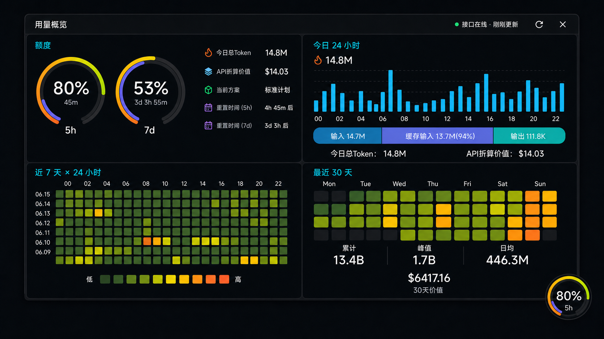

# OpenWatcher Desktop 悬浮球与用量面板设计

- 日期：2026-07-11
- 状态：交互、视觉、架构、异常处理和验收范围均已在设计讨论中确认
- 当前阶段：仅设计，不包含产品代码实现

## 1. 目标

为 OpenWatcher Desktop 增加一个常驻桌面的悬浮球。用户单击悬浮球后，可直接查看与手表端数据能力一致的用量概览，但使用适合桌面大屏的四象限布局，不复制圆形手表容器或逐页导航。

核心目标：

- 悬浮球直接显示 5h 与 7d 剩余额度，降低打开完整应用的频率。
- 展开面板同时显示额度、最近 7 天逐小时用量、今日逐小时用量、最近 30 天用量与 API 折算价值。
- 所有用量数据继续由 OpenWatcher sidecar 的 HTTP/SSE 接口提供，Widget 不读取 Codex 会话文件、缓存数据库或 Desktop 内部统计状态。
- 手表与桌面共用同一服务端统计结果、字段语义和异常语义。
- Widget 不请求、不保存、不展示会话标题、消息和会话详情。
- 主控制台和 Widget 可同时存在，互不替代。

## 2. 不在本功能范围内

- 不在 Widget 中展示会话列表、会话详情、消息、模型或 reasoning effort。
- 不把 Widget 做成圆形手表模拟器。
- 不复制手表端的触摸翻页、表冠滚动或页面跳转方式。
- 不允许 Widget 直接读取 ~/.codex、~/.openwatcher/cache、SQLite 或 rollout 文件。
- 不在本设计阶段实现代码、迁移配置或修改安装包。
- 不提供自由拖拽改变面板尺寸。

## 3. 已确认的产品决策

| 主题 | 决策 |
| --- | --- |
| 数据来源 | 通过 sidecar 的 HTTP/SSE 接口获取，与手表端共享服务端统计事实 |
| 数据范围 | 5h/7d 额度、7×24 小时热力图、今日 24 小时、最近 30 天、对应 API 折算价值 |
| 30 天含义 | 最近 30 个完整自然日，沿用 dailyTrend30d 的 startDate 与 endDate；当前接口的 endDate 为昨日 |
| 会话数据 | Widget 请求明确排除 sessions，前端也不建立会话状态 |
| 视觉方向 | 保留手表端的近黑背景、青色标题、额度环和彩色热力等级，改成轻量桌面面板 |
| 展开布局 | 2×2 四象限，同屏直接展示全部核心内容 |
| 窗口方案 | 独立 openwatcher-widget 辅助程序，采用 Wails v2 + Vue 3 |
| 悬浮球行为 | 可拖动、吸附屏幕边缘、按显示器记住位置；单击展开或收起 |
| 额度轮播 | 5h 与 7d 各显示 4 秒，350ms 交叉淡入；悬停暂停 |
| 面板关闭 | 再次单击悬浮球、按 Esc 或单击关闭按钮；失去焦点不自动关闭 |
| 安装默认值 | 新安装默认启用；已有安装升级后默认关闭，用户可在设置中开启 |

## 4. 现有代码约束

设计基于 2026-07-11 的仓库事实：

- Desktop 使用 Wails v2.12.0 和 Vue 3，当前主窗口约 1320×860。
- Wails v2 的公开窗口运行时主要控制当前窗口，不适合在现有主进程内同时维护主控制台与第二个独立悬浮窗口。
- macOS 已有原生状态栏入口，Windows 状态栏实现目前为空壳；Widget 必须采用两端都可打包的独立辅助程序。
- sidecar 已有 GET /api/status 与 GET /api/status/stream。
- includeDailyTrend30d=1 已能在完整快照中返回 dailyTrend30d。
- SSE 默认约每 5 秒检查数据变化，并约每 15 秒发送 heartbeat。
- 服务端已有 quota、heatmap24h、heatmap7d、dailyUsage 和 dailyTrend30d。
- 当前认证按手表 pairing slot 保存 token 哈希，Desktop 不持久保存手表原始 token，因此 Widget 不能复用或覆盖手表凭据。

## 5. 视觉基准

该图是已经确认的视觉方向，主要约束配色、信息层级、四象限关系、额度环和图表语言。图中数字均为演示值，运行时必须显示接口真实结果。

生成图存在不可避免的几何误差，实施时以下结构规则优先于图片像素：

- 最近 7 天热力图必须严格为 7 行 × 24 列，所有格子为正方形。
- 最近 30 天必须严格为 5 行 × 7 列，包含 30 个数据格和 5 个空占位格，所有格子为正方形。
- 今日逐小时图必须恰好有 24 根柱。
- 今日总 Token 与今日 API 折算价值只放在右上象限，不在左上额度区重复。
- 最近 30 天区域显示 30 天累计、峰值、日均和 30 天价值。

### 5.1 颜色与材质

| 用途 | 建议颜色 |
| --- | --- |
| 应用背景 | #05070B |
| 面板背景 | #0D121A 至 #111823 |
| 主文字 | #F4F7FB |
| 次文字 | #ADB9CC |
| 信息标题 | #27E7F4 |
| 面板边线 | #303844，低透明度 |
| 额度环 | 橙色、紫色、荧光黄绿与绿色，沿用手表端语义 |
| 热力图 | #161A19、#213326、#4E6F25、#A4B61E、#FFB320、#FF5B2D |
| 今日组成 | 输入蓝、缓存输入紫、输出青绿 |

面板采用 1px 轻边线、克制圆角和少量阴影。数字使用等宽数字特性，避免数据刷新时宽度跳动。顶部不放品牌 Logo、侧栏、会话入口或设置入口。

## 6. 窗口与悬浮球

### 6.1 两种窗口状态

辅助程序只创建一个透明、无边框、置顶窗口，并在两种状态之间切换：

| 状态 | 可见内容 | 目标尺寸 |
| --- | --- | --- |
| 收起 | 仅 56×56 悬浮球 | 56×56 逻辑像素 |
| 展开 | 四象限面板与锚点悬浮球 | 面板默认约 1120×580 逻辑像素 |

展开后的悬浮球保留在面板锚点一角，既说明面板来源，也作为收起按钮。透明窗口的实际命中区域必须限制在悬浮球和面板上，不能用不可见矩形遮挡桌面点击。

面板根据当前显示器工作区自适应缩小，常规下限约为 920×500。工作区不小于 1280×720 时，四个象限应全部可见且不出现滚动。更小的分屏或特殊工作区优先整体等比压缩；低于结构下限时才允许面板内部滚动，且窗口始终保留至少 12px 屏幕边距。

### 6.2 拖动、吸附与位置恢复

- 按下悬浮球并移动超过 4 个逻辑像素后判定为拖动，本次操作不再触发展开。
- 松开后吸附到当前显示器最近的工作区边缘。
- 持久化显示器标识、吸附边和沿边归一化位置，不只保存绝对屏幕坐标，以适应 DPI 和分辨率变化。
- 展开方向选择可用空间更大的一侧，并把完整面板限制在当前工作区内。
- 显示器移除或工作区变化后，将悬浮球迁移到主显示器最近的可见位置。
- 展开状态也可拖动锚点悬浮球，面板随锚点移动并重新计算展开方向。

### 6.3 额度轮播

- 悬浮球显示 quota.fiveHour.remainingPercent 或 quota.weekly.remainingPercent，而不是 usedPercent。
- 外层额度弧与手表端一致表示剩余额度；时间弧根据 resetAt 与 observedAt 表示剩余时间。
- 中央显示整数百分比，下方显示 5h 或 7d。
- 5h 显示 4 秒后，以 350ms 交叉淡入切换到 7d；7d 同样显示 4 秒。
- 鼠标悬停时暂停计时，移出后从当前剩余时长继续。
- 系统启用减少动态效果时，仍每 4 秒切换，但取消淡入动画。
- quota.status 为 stale 时保留最近值但整体降亮度；为 unavailable 或缺少两个窗口时停止轮播，改为灰色环与短横线。

### 6.4 展开与关闭

- 单击悬浮球在收起和展开之间切换。
- 展开面板失去焦点后继续保留。
- 再次单击悬浮球、单击右上角关闭图标或按 Esc 均收起面板。
- 收起时清除图表的固定提示，不清除最后一次有效数据。
- 手动刷新按钮与关闭按钮位于右上角；刷新必须在按钮附近显示进行中、成功或失败反馈。

## 7. 四象限信息设计

面板顶部为约 44px 的紧凑标题栏，显示“用量概览”、接口状态、最近更新时间、刷新和关闭。标题栏下方为等宽两列、两行四象限；上排稍矮，下排为热力图留出更多高度。

| 位置 | 内容 | 显示规则 |
| --- | --- | --- |
| 左上 | 5h 与 7d 额度环 | 同时显示两个环、剩余百分比、重置倒计时、当前计划与额度状态 |
| 左下 | 最近 7 天 × 24 小时 | 7 行日期、24 列小时、正方形单元格、低到高图例 |
| 右上 | 今日 24 小时 | 24 根小时柱、今日组成条、今日总 Token、API 折算价值 |
| 右下 | 最近 30 天 | 5×7 weekday 日历热力图、累计、峰值、日均与 30 天价值 |

### 7.1 左上：额度

- 5h 与 7d 环同时可见，数值语义与悬浮球一致。
- 每个环显示剩余百分比与距 resetAt 的剩余时长。
- 右侧只显示计划、更新时间和额度服务状态，不重复今日 Token 与价值。
- quota.fresh 为 false 或 quota.status 为 stale 时使用降亮度状态，并显示“额度数据已缓存”。
- 单个窗口缺失时只让对应环进入未知态，另一个仍正常显示。

### 7.2 左下：最近 7 天 × 24 小时

- heatmap7d.days 的最近 7 日倒序显示，最新日期在最上方。
- 每行严格补齐 24 个小时；缺失值视为零，但缺失整份 heatmap7d 不能伪装成全零。
- 单元格边长由可用宽度计算，宽高必须相同，间距固定。
- 强度使用 heatmap7d.peakTokens 归一化，并采用与手表端 weeklyHeatmapCellColor 一致的六级阈值。
- 横轴每 2 小时标注一次，悬停任意格显示完整日期、小时区间和 Token。
- 单击格子可固定提示；再次单击、单击空白区域或收起面板后取消固定。

### 7.3 右上：今日 24 小时

- 24 根柱逐一对应 heatmap24h.buckets 的 00:00 至 23:00。
- 柱高按今日峰值小时归一化；零值小时保留基线位置。
- 悬停显示小时区间、输入、缓存输入、输出、reasoning output、总 Token 和活跃线程聚合数。
- 单击柱可固定读数；后台 SSE 更新时按 hourStart 保留选择，而不是按数组位置保留。
- 今日组成条按三组展示：
  - 未缓存输入：inputTokens − cachedInputTokens
  - 缓存输入：cachedInputTokens，并附 cachedInputTokens ÷ inputTokens 的 CHR
  - 输出：outputTokens + reasoningOutputTokens
- 标签中的“输入”仍显示完整 inputTokens，与手表端一致；组成条计算不能重复累计缓存输入。
- 今日总量直接使用 dailyUsage.totalTokens。
- API 折算价值直接显示 dailyUsage.estimatedValueLabel，不在 Widget 中重新定价。字段不可用时显示短横线和“今日价值不可用”，不得显示 $0.00。

### 7.4 右下：最近 30 天

- 数据来自 dailyTrend30d.days，表示 startDate 至 endDate 的 30 个完整自然日，不包含今日。
- 固定为 5 行 × 7 列，列标题为 Mon 至 Sun，30 个数据格和 5 个空占位格。
- 为同时满足固定 5×7 和滚动 30 日，日期按星期列分组，每列由旧到新排列最多 5 次出现；行表示该星期在窗口中的出现序号，不宣称是一整条自然周。
- 所有格子宽高相同。占位格使用低对比空槽，不参与强度统计或点击。
- 每日强度沿用手表端日历热力色阶，以 30 日最小值和最大值归一化；全部为零时使用空等级，全部为相同非零值时采用中间等级。
- 悬停或单击显示精确日期与 Token；固定选择按日期键保持。
- 累计、峰值和日均直接使用 dailyTrend30d.totalTokens、peakTokens 与 averageTokens。
- 30 天价值直接使用 dailyTrend30d.estimatedValueLabel；不可用时显示短横线和“30天价值不可用”。

## 8. 桌面图表交互

功能与数据能力和手表端一致，但交互按桌面设备调整：

- 所有核心内容始终在同一面板，不通过点击热力图区进入新页面。
- 鼠标悬停用于短暂查看精确值。
- 单击图表元素固定提示，方便对照；单击其他元素切换固定对象。
- 固定提示在 SSE 更新时保留对应日期或小时，并同步更新其数值。
- 键盘焦点可到达刷新、关闭、两个额度环和图表单元；Enter 或 Space 等价于单击固定。
- Tooltip 不遮挡当前格或相邻主要数值，靠近屏幕边缘时自动翻转方向。

## 9. 进程与组件架构

### 9.1 选择独立辅助程序

采用 openwatcher-widget 辅助程序，原因是：

- 主控制台与悬浮窗口可同时存在。
- 不要求把现有 Desktop 主窗口升级到另一套多窗口框架。
- Widget 的无边框、透明、置顶、进程生命周期和崩溃恢复可以独立管理。
- macOS 与 Windows 共用 Wails v2 + Vue 3 主体，只把凭据存储、窗口层级和安装包入口留给平台适配层。

代价是安装包需要增加辅助二进制、签名目标和进程管理逻辑，但比改写现有主窗口或复制两套原生 UI 风险更可控。

### 9.2 组件职责

1. **OpenWatcher Desktop 主进程**
   - 保存 Widget 开关和位置偏好。
   - 生成、安装和显式轮换 Widget 专用凭据。
   - 启动、监控和停止辅助程序。
   - 在辅助程序请求时激活现有主窗口。

2. **OpenWatcher sidecar**
   - 继续作为唯一用量事实源。
   - 复用现有状态构建逻辑。
   - 新增仅监听 loopback 的只读 Widget 状态入口。
   - 只接受 Widget 专用凭据，并拒绝其他路径和方法。

3. **openwatcher-widget Go 层**
   - 在启动时从 Desktop 创建的匿名标准输入管道读取一次 Widget token，只保存在进程内存中。
   - 通过 Go HTTP 客户端请求完整快照并维护 SSE。
   - 将原始响应转换成不含会话数组的 Widget ViewModel。
   - 通过 Wails 事件把结构化状态发送给 Vue。
   - 管理窗口尺寸、位置、显示器变化和系统降低动态效果设置。

4. **openwatcher-widget Vue 层**
   - 只渲染 Go 层提供的 ViewModel。
   - 不接触 token，不自行发 HTTP，不使用 localStorage 保存业务数据。
   - 维护悬停、固定提示、轮播和局部视觉状态。

5. **手表端**
   - 继续使用原有公开或局域网状态入口与手表 pairing token。
   - 默认请求与响应不受 Widget 扩展影响。

### 9.3 运行时数据流

1. Desktop 启动后读取 Widget 偏好；启用时确认专用凭据存在并启动辅助程序。
2. sidecar 建立独立 loopback 状态监听，Desktop 将非敏感 endpoint 放入启动参数，并通过仅连接父子进程的匿名标准输入管道传递 token；token 不放入命令行或环境变量。
3. Widget Go 层在进入 Wails 运行循环前读取并校验 token，随后关闭管道；Vue 与窗口状态均无法访问该值。
4. Widget 先请求完整快照，再连接 SSE。
5. Go 层验证和归一化响应，Vue 只收到额度、图表、价值、状态和时间字段。
6. 关闭主窗口只隐藏控制台，不停止辅助程序；显式退出 OpenWatcher 时先停止辅助程序，再停止 sidecar。

Widget 可以读取自身窗口偏好和非敏感连接元数据，但任何用量、额度、价值或会话统计都只能通过 HTTP/SSE 获取。

## 10. API 契约

### 10.1 请求

Widget 使用：

- GET /api/status?includeDailyTrend30d=1&includeSessions=0
- GET /api/status/stream?includeDailyTrend30d=1&includeSessions=0

新增 includeSessions 查询参数，规则如下：

- 参数缺省时为 true，保证现有手表行为和契约不变。
- 设为 0 或 false 时，完整快照不序列化 sessions，SSE 也不发送 status_sessions。
- dailyUsage.activeSessions 作为不可识别的聚合统计可以保留在接口中，但 Widget 当前不显示它。
- ok、observedAt、quota、heatmap24h、heatmap7d、dailyUsage、dailyTrend30d 和 errors 继续沿用现有字段。

loopback Widget 监听只开放上述两个 GET 路径。即使主 sidecar 以 no-auth 模式运行，Widget 监听仍必须验证独立 token。

### 10.2 UI 字段映射

| UI | 接口字段 |
| --- | --- |
| 5h 额度 | quota.fiveHour.remainingPercent、resetAt |
| 7d 额度 | quota.weekly.remainingPercent、resetAt |
| 当前计划 | quota.planType |
| 额度状态 | quota.status、quota.fresh |
| 7×24 热力图 | heatmap7d.days[].date、hours[]、peakTokens |
| 今日小时柱 | heatmap24h.buckets[].hourStart、totalTokens |
| 小时明细 | inputTokens、cachedInputTokens、outputTokens、reasoningOutputTokens |
| 今日组成和总量 | dailyUsage 对应 token 字段与 totalTokens |
| 今日价值 | dailyUsage.estimatedValueLabel |
| 最近 30 天 | dailyTrend30d.days、startDate、endDate |
| 30 日摘要 | totalTokens、peakTokens、averageTokens |
| 30 日价值 | dailyTrend30d.estimatedValueLabel |
| 数据时间 | observedAt、各模块 generatedAt、timezone |

所有可见时间按接口返回的 timezone 解释；当前默认环境为 Asia/Shanghai。不得让浏览器或操作系统的显示时区改变日期归属。

### 10.3 快照与 SSE

- 首次启动请求一次完整快照，成功后立即渲染。
- 随后连接 SSE；首个 status_snapshot 替换完整状态。
- status_quota 只更新额度区和悬浮球。
- status_heatmap24h 更新 heatmap24h、heatmap7d 和 dailyUsage。
- status_errors 更新模块异常状态。
- heartbeat 只更新连接活性，不伪装成业务数据更新。
- Widget 不处理也不应收到 status_sessions。
- dailyTrend30d 在启动、手动刷新、SSE 重连成功和接口时区跨日后重新请求完整快照。
- 手动刷新流程为完整 GET 成功后重建 SSE，避免部分模块处于不同 observedAt。
- SSE 断开后按 1s、2s、5s、10s、30s 上限重试，并加入小幅随机延迟，防止高频重连。

## 11. 凭据与安全

- Widget 使用独立的强随机凭据，与 watch pairing slot 完全分离。
- sidecar 配置只保存 token 哈希，不保存原文。
- 原始 token 在 macOS 存入 Keychain，在 Windows 存入 Credential Manager。
- Desktop 每次启动辅助程序时从系统凭据存储读取 token，并通过匿名管道一次性传递；辅助程序不直接共享 Keychain 或 Credential Manager 权限。
- token 不得出现在命令行参数、环境变量、日志、诊断包、URL、Vue 状态、localStorage 或崩溃报告中。
- HTTP/SSE 由 Go 层发起，Vue WebView 无法读取 token。
- Widget 状态监听只绑定 127.0.0.1 或 ::1，并再次校验 RemoteAddr 为 loopback。
- Widget 凭据只能访问只读状态路径，不能调用 pairing、配置、诊断、更新或其他写接口。
- 手表 token 不能通过 Widget 监听；Widget token 也不能通过手表公开监听。
- 认证失败不自动覆盖凭据。界面提示“悬浮球凭据已失效”，并提供打开 OpenWatcher 设置的动作；只有用户明确执行重新授权才轮换。
- 日志可以记录连接状态、HTTP 状态码和重试次数，但不能记录请求头、token、完整状态响应或会话字段。

## 12. 生命周期与设置迁移

### 12.1 设置

Desktop 设置增加“桌面悬浮球”开关：

- 设置文件不存在时视为新安装，默认 true。
- 设置文件已存在但缺少该字段时视为升级安装，迁移为 false。
- 字段一旦写入，后续升级保留用户选择。
- 打开开关后立即准备凭据并启动辅助程序；关闭后先收起窗口，再结束辅助程序。

该迁移需要检查 JSON 字段是否存在，不能仅依赖 Go bool 的零值。

### 12.2 进程管理

- Desktop 是辅助程序的唯一 owner。
- 辅助程序使用单实例锁；重复启动时新进程退出并通知现有实例聚焦或保持原状。
- 主窗口隐藏、最小化或关闭到状态栏时，辅助程序继续运行。
- 用户显式退出 OpenWatcher 时，辅助程序随主进程结束。
- 辅助程序意外退出后，Desktop 在 5 分钟内最多重启 3 次，建议间隔为 1s、5s、15s。
- 达到上限后停止自动重启，在主应用设置中显示错误；下次显式切换开关或重启应用后再尝试。
- Desktop 与辅助程序版本必须一致，更新时先停止旧辅助程序，再替换和启动新版本。

### 12.3 打包表现

- macOS 辅助程序不创建额外 Dock 图标。
- Windows 辅助程序不创建额外任务栏按钮或控制台窗口。
- 辅助二进制进入 macOS 与 Windows 安装包、签名、公证、完整性校验和公开残留扫描。
- 卸载时删除普通 Widget 偏好；系统凭据按现有卸载策略处理，并提供显式清理能力。

## 13. 状态与异常设计

连接状态和各数据模块状态分开处理，不能用“接口在线”暗示所有模块都新鲜。

| 场景 | 悬浮球 | 展开面板 |
| --- | --- | --- |
| 首次加载 | 灰色空环与短横线 | 显示“正在连接”，不放示例数值 |
| 正常 | 正常轮播 | 顶部绿点、“接口在线”与最近数据更新时间 |
| 30 秒无数据或 heartbeat | 保留值 | 显示“正在重连”，立即发起重连 |
| 60 秒仍无新鲜数据 | 降亮度 | 明确显示“数据可能已过期”和最后更新时间 |
| quota stale | 额度环降亮度 | 额度区显示“额度数据已缓存”，其他区不受影响 |
| quota unavailable | 灰色环、停止轮播 | 只让额度象限进入不可用态 |
| 单个统计模块缺失 | 其他内容保持 | 对应象限显示短空态，不能用全零伪装 |
| dailyTrend30d 缺失 | 其他内容保持 | 最近 30 天显示“30天数据不可用”，价值也显示短横线 |
| sidecar 未运行 | 灰色离线环 | 显示“本机服务未运行”和“打开 OpenWatcher” |
| Widget token 失效 | 灰色凭据状态 | 提示打开设置重新授权，不静默换 token |
| 手动刷新 | 保留旧值 | 刷新按钮显示进度；成功显示短反馈，失败保留旧值并显示原因 |
| 显示器移除 | 无异常闪烁 | 移到主显示器可见工作区并保存新位置 |

“打开 OpenWatcher”只负责激活已经运行的主应用，不由 Widget 直接修改后端配置或启动写操作。

## 14. 可访问性与性能要求

- 文字与背景满足桌面深色界面的可读对比度。
- 颜色不是唯一状态表达；stale、offline、unavailable 均有文本或图标。
- 图表单元可通过键盘访问，并提供可读的 aria-label，包括日期、小时和 Token。
- 悬浮球与标题栏按钮有稳定命中区域，不因动画改变位置。
- 高频 SSE 更新只替换变化模块，不重建整个 Vue 树，不打断 hover、焦点或固定提示。
- 数值更新不产生布局跳动。
- 辅助程序常驻时应避免持续高 CPU；未展开时 Vue 只更新悬浮球必需状态。
- 面板已打开且辅助程序正在运行时，单击悬浮球后的可见反馈目标为 200ms 内出现；SSE 事件到 UI 更新目标为 1 秒内完成。

## 15. 测试与验收

### 15.1 Go 与接口契约

- includeSessions 缺省时现有 status JSON 与 SSE 契约保持不变。
- includeSessions=0 时 JSON 不包含 sessions，SSE 不发送 status_sessions。
- Widget loopback 监听只接受 Widget token 和两个 GET 状态路径。
- 验证非 loopback、watch token、无 token、错误 token、写方法和其他路径均被拒绝。
- 验证 token 不进入日志、进程参数、环境变量和诊断输出。
- 验证完整快照、SSE 增量、重连、30s/60s 新鲜度状态和接口时区跨日刷新。
- 验证 API 折算价值直接来自 estimatedValueLabel，缺失时不生成假值。

### 15.2 Vue 与布局

- 默认约 1120×580 时四个象限同时可见，无分页和内部页面跳转。
- 7×24 热力图恰好 168 个正方形数据格。
- 最近 30 天恰好 35 个正方形槽位，其中 30 个数据格、5 个占位格。
- 对全部七种 startDate 星期情况测试 weekday 列映射，确保不丢失、重复或错配日期。
- 今日图恰好 24 根柱；小时选择按 hourStart 保持。
- 今日组成条不重复累计 cachedInputTokens，输出包含 reasoningOutputTokens。
- 覆盖正常、加载、stale、unavailable、offline、认证失败、局部缺失和减少动态效果状态。
- hover、单击固定、后台更新和键盘焦点互不干扰。

### 15.3 端到端

- 新安装默认启用，已有设置文件升级时默认关闭。
- 设置开关能启动和停止辅助程序。
- 隐藏主窗口后 Widget 继续；显式退出后 Widget 结束。
- sidecar 停止、重启或监听地址变化后，Widget 能显示正确状态并恢复。
- 同一 observedAt 下逐项比对 Widget 与 API：5h/7d、168 个热力格、24 个小时桶、今日组成、30 日统计和两处价值。
- Widget 网络响应、Go ViewModel、Vue 状态、DOM 和日志均不存在会话标题、消息或 sessions 数组。
- 辅助程序连续崩溃不会无限重启。

### 15.4 视觉与平台

- 以本设计中的效果图作为配色、层级和布局参考进行截图比对。
- 结构检查优先验证格子数量、正方形比例、24 根柱、四象限边界和不重复信息。
- 在 macOS Retina 与 Windows 100%、125%、150%、200% 缩放下检查。
- 工作区不小于 1280×720 时全部内容无需滚动，文字不截断、不重叠。
- 检查四边吸附、四个屏幕角、多个显示器、显示器移除、Dock 或任务栏工作区变化。
- 确认透明区域不拦截桌面点击。
- 安装包内包含辅助程序，且没有额外 Dock、任务栏或控制台入口。

## 16. 完成判定

实现完成时，用户展开面板后应能在一个视图中立即判断：

1. 5h 与 7d 还剩多少额度、何时重置。
2. 最近 7 天哪些日期与小时消耗最高。
3. 今日各小时和输入、缓存输入、输出的消耗构成。
4. 今日总 Token 与 API 折算价值。
5. 最近 30 个完整自然日的分布、累计、峰值、日均和折算价值。
6. 当前数据是否在线、新鲜或仅为缓存。

若任一判断仍需打开会话页、切换 Widget 内部页面，或 Widget 读取了本机统计文件，则不符合本设计。
